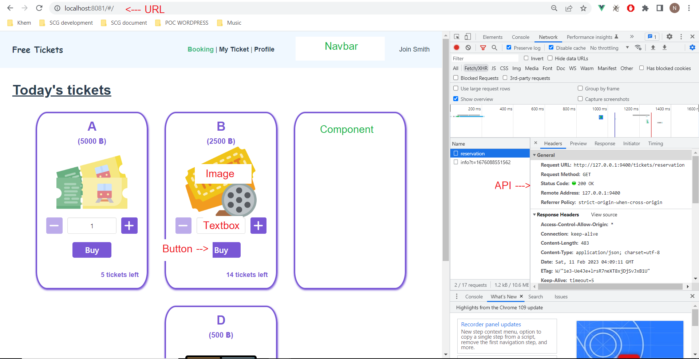
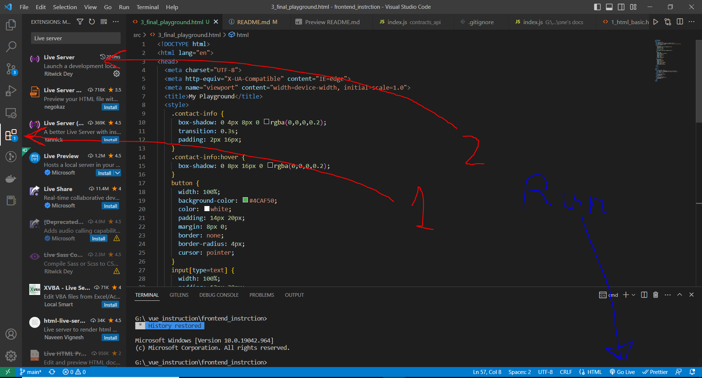
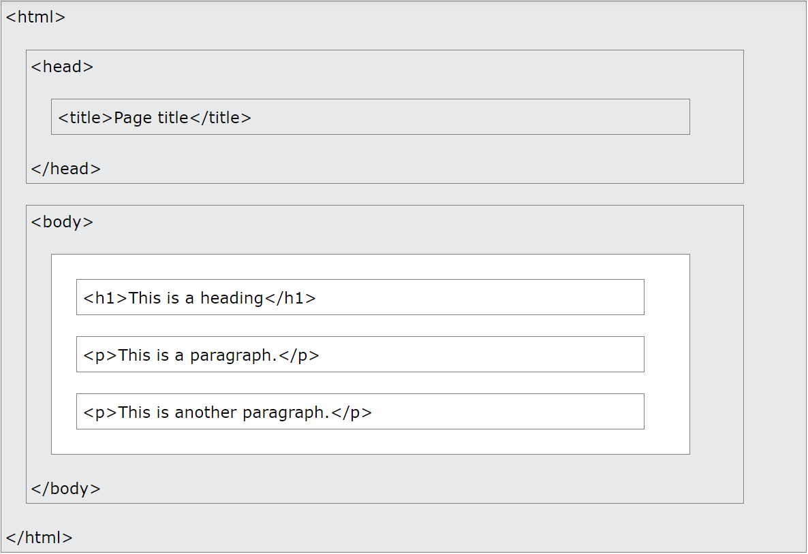
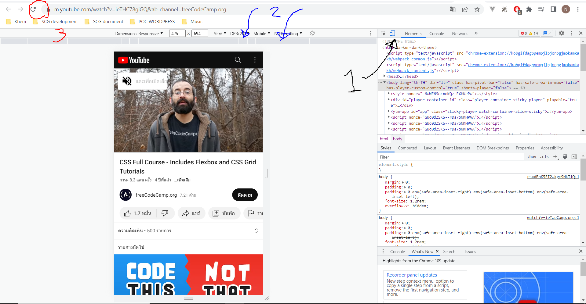
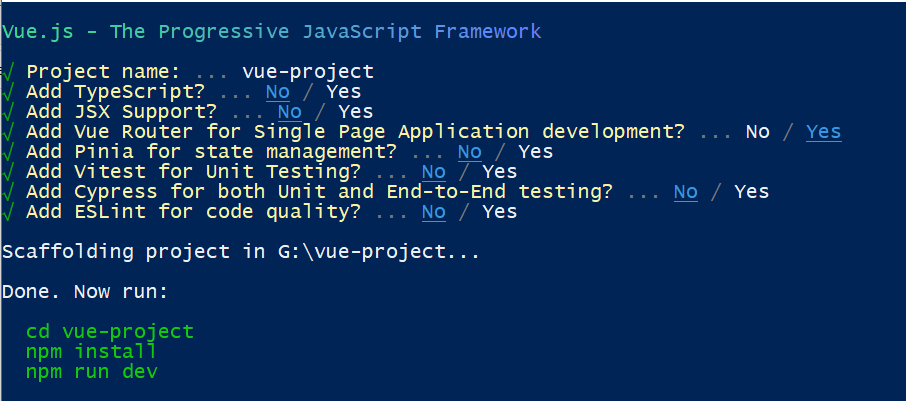
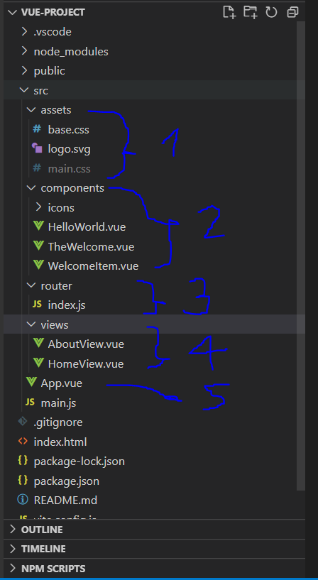
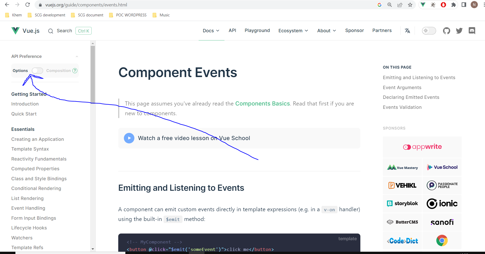

# Lessons 
0. Tips from a software developer to students 
1. Old-school front-end web concept 
  + HTML BASIC
  + WHY CSS ?
  + WEB RESPONSIVE
  + WHY JAVASCRIPT ?
  + FUNDAMENTAL JAVASCRIPT
  + GETTING DATA USING FETCH API
2. Introduction to modern web development
  + WHY FRONTEND FRAMEWORK ?
  + INITIALIZE VUE2 PROJECT
  + DEFAULT PROJECT CODE EXPLANATION AND FILE STRUCTURE
  + TECHNICAL CONCEPT
    + * State and Methods
    + Lifecycle Diagram
    + Template Syntax
    + Computed Properties and Watchers
    + * Components and properties
    + Connect a web app with API


## 0. Tips from a software developer to students
----

># FOCUS ON ITS DUTY AND ITS TECHNICAL NAME.
># "GOOGLE" IT TO FIND THE ANSWER





>## Basic of the most programming languages are the same.


```javascript
/* javascipt  */

/* Variable */
let num = 12;
let myJson = { a: "dog", b: 2}
let text = "Polar";
let myArray = [0, 10, 20, 30];

/* Reassign variable */
num = 13;
myJson.b = 2222; 

/* Reassign variable */

if (false) {
	console.log("something");
} else if (num > 13) {
	console.log("something = statement");
} else {
	console.log("statement");
}

// _________ loop array _________
for (let i = 0; i < myArray.length; i++) {
  console.log("4 times array", myArray[i]);
}
for (let value of myArray) {
  console.log("4 times array", value);
}
myArray.map((value) => {
  console.log("4 times array", value);
})

for (let key in myJson) {
  console.log("2 times json", myJson[key]);
}
// _________ function _________
function test(x){
	console.log("statement + condition + function");
  return `variable ${x}`;
}
```
>### Popular front-end framework (REACT, VUE, ANGULAR, SVELTE)
  + Core concept are the same.
    + components
    + state management
    + router
  + But there is something different 
    + ways to code
    + rending the UI

----
## 1. Old-school front-end web concept
### HTML Basic

+ My tutorial file
  + lesson1 directory --> 1_html_basic.html
  + [./lesson1/1_html_basic.html](./lesson1/1_html_basic.html)
+ How to run html as live server

+ Guide to study HTML
  + [HTML on youtube - 45:19](https://www.youtube.com/watch?v=916GWv2Qs08&ab_channel=freeCodeCamp.org)
  + [Play HTML in w3school](https://www.w3schools.com/html/html_intro.asp)
  + [Study HTML with God](https://www.google.com/search?q=html&rlz=1C1CHBD_enTH893TH893&oq=html&aqs=chrome.0.69i59l4j0i433i512j69i60l3.1068j0j7&sourceid=chrome&ie=UTF-8)
+ Stuff you should know

### WHY CSS ?
Make website beautiful 
+ My tutorial file
  + lesson1 directory --> 2_playground.html
  + [./lesson1/2_playground.html](./lesson1/2_playground.html)
+ Guide to study CSS
  + [Study CSS with God](https://www.google.com/search?q=css+tutorial&rlz=1C1CHBD_enTH893TH893&oq=css+tu&aqs=chrome.0.69i59i512j69i57j0i512j0i22i30i625l2j69i60l3.1665j0j7&sourceid=chrome&ie=UTF-8)
  + [CSS on youtube - 1:25:38](https://www.youtube.com/watch?v=ieTHC78giGQ&ab_channel=freeCodeCamp.org)
+ Web responsive (Mobile, tabet, and desktop screen size)
  + How to see another screen size 
  + [Media query](https://www.w3schools.com/css/css_rwd_mediaqueries.asp)
  + [Media query on youtube - 21:16](https://www.youtube.com/watch?v=ZYV6dYtz4HA&ab_channel=DaniKrossing)
  + [Layout for responsive web on youtube - 17:13](https://www.youtube.com/watch?v=68O6eOGAGqA&ab_channel=AngelaDelise)

### WHY JAVASCRIPT ?
+ Make website interactive
  + [Guide to study javascript in Thai - 3:16:22](https://www.youtube.com/watch?v=PGZ7QiKdumo&ab_channel=BorntoDev)
  + what makes javascript special
```html
  <body>
    <button onClick="functionYouLike(1150)">Any tag you like</button>
    <div id="your-id"></div>
    <script>
      document.getElementById("your-id").innerHTML = "Please click the button";
      function functionYouLike(num) {
        if (num === 1150) {
          document.getElementById("your-id").innerHTML = "PIZZA!!!!!";
          alert("pizza");
        } else if (num === 191) {
          alert("police");
        } else {
          alert("????");
        }
      }
    </script> 
  </body>
```
+ API Calling
  + [Call API in javascript on youtube - 6:34](https://www.youtube.com/watch?v=cuEtnrL9-H0&ab_channel=WebDevSimplified)
  + My tutorial file
    + lesson1 directory --> 4_final_playground.html
    + [./lesson1/4_final_playground.html](./lesson1/4_final_playground.html)
```javascript
    // CALL API GET METHOD
    fetch("http://localhost:3000/contact", {
      method: 'GET'
    })
    .then(response => response.json())
    .then(data => {
      console.log("Do something great here");
      console.log(data);
    })
    .catch((error) => {
      console.error(error);
    });

    //  CALL API POST METHOD
    /*
      Request body = {
        "fullname": "Nitinun Manapattanachewin",
        "mobile": "0801911150"
      }
    */
    fetch("http://localhost:3000/contact", {
      method: 'POST',
      headers: {
        'Content-Type': 'application/json',
      },
      body: JSON.stringify({
        "fullname": "Nitinun Manapattanachewin",
        "mobile": "0801911150"
      }),
    })
    .then(response => response.json())
    .then(data => {
      console.log("Do something great here");
      console.log(data);
    })
    .catch((error) => {
      console.error(error);
    });
```

2. Introduction to modern web development
  + WHY FRONTEND FRAMEWORK ?
  + INITIALIZE VUE2 PROJECT
  + DEFAULT PROJECT CODE EXPLANATION AND FILE STRUCTURE
  + TECHNICAL CONCEPT
    + * ### State and Methods
    + Lifecycle Diagram
    + Template Syntax
    + Computed Properties and Watchers
    + * ### Components and properties
    + Connect a web app with API
## 2. Introduction to modern web development
  + WHY FRONTEND FRAMEWORK ?
    + [More detail about front-end framework](https://www.ideamotive.co/blog/best-frontend-frameworks)
  + INITIALIZE VUE2 PROJECT 
```console
npm init vue@2
```

  + DEFAULT PROJECT CODE EXPLANATION AND FILE STRUCTURE
    + 
    1. Assets - Vue file in project can use file in assets (PNG, GIF, CSS, etc)
    2. Components - reusable code in logic and style for your element
    ```html
      <HelloWorld />
      <your-element>abcdef</your-element>
    ```
    3. Routers - connect vue file in the project with url path
      + "localhost:5173/about" --> AboutView.vue
    4. Views - Vue file for router
    5. App.vue - The first file you should take a look
## MODERN WEB CORE CONCEPT
+ [State](https://v2.vuejs.org/v2/guide/instance.html#Data-and-Methods)
+ [Components](https://v2.vuejs.org/v2/guide/components.html)
+ [Passing props](https://v2.vuejs.org/v2/guide/components-props.html)
+ [State Management (learn this at your workplace)](https://pinia.vuejs.org/introduction.html)

```html
This is pseudo code, not the real code

For learning -- state, prop, and components

  <body>
    <!-- Pass string props -->
    <my-element fullname="John Doe" mobile="0812345678" />
    <my-element fullname="Khem" mobile="0801911150" />

    <!-- Pass variable string props -->
    <my-element fullname=stateFullname mobile=stateMobile />
  </body>
  <script>
    // Just concept you cannot use this in real code
    var stateFullname = "dog";
    var stateMobile = "0801911152";
  </script> 
```
## RUN VUE FROM LESSON 2 DIRECTORY
```bash
  cd ./lesson2
  npm install
  npm run dev
```

## GUIDE TO STUDY VUE 2 
+ [Vue 2 docs](https://v2.vuejs.org/v2/guide/index.html)
  + switch toggle to "options API"
  + 
+ [Study Vue2 with god](https://www.youtube.com/results?search_query=vue+2+tutorial)
+ [Inspiration of vue - documentary](https://www.youtube.com/watch?v=OrxmtDw4pVI&ab_channel=Honeypot)

## MY INTERVIEW CODE
+ https://github.com/Khem-580/docker-vue-mysql-express
+ I give this code to everyone, but just the right person can RUN IT!
